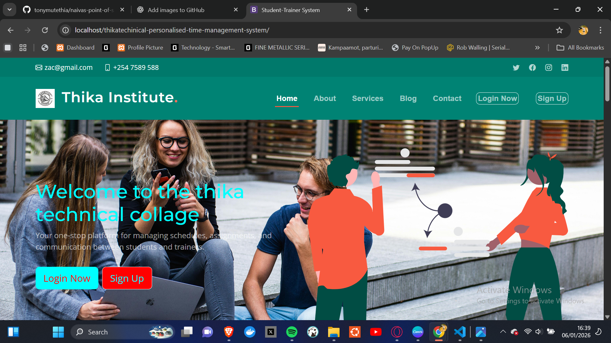
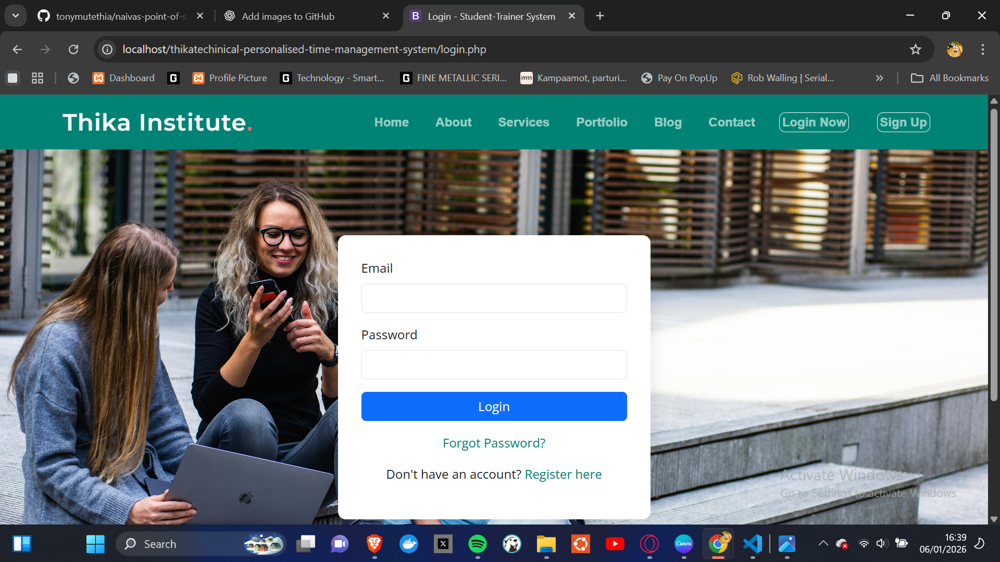
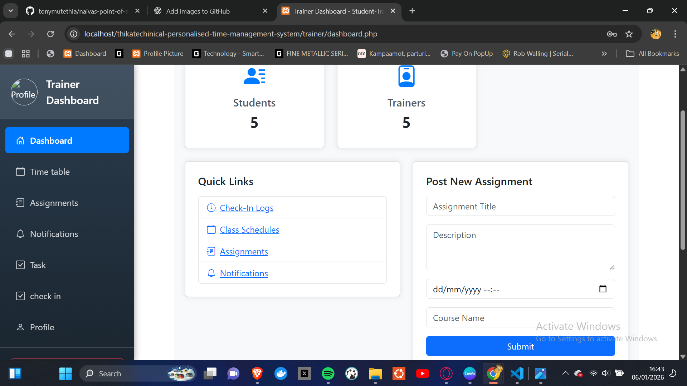
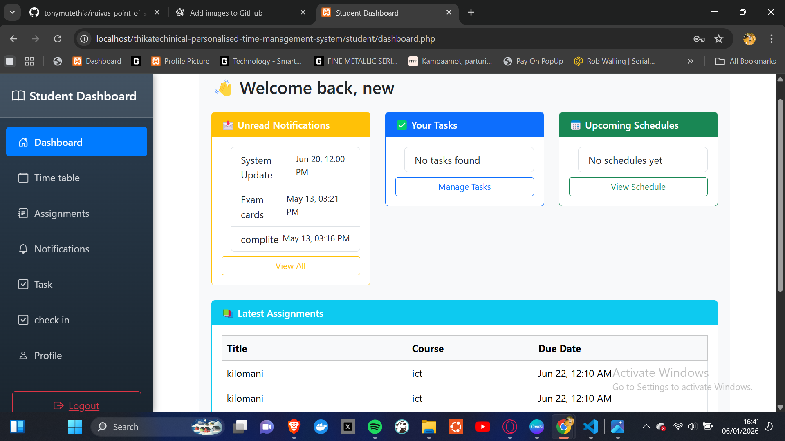

# Personalised Time Management System

A web-based Personalised Time Management System developed as a student project to help users plan, organize, and manage their daily activities efficiently.

## 📌 Project Overview
The system allows users to:
- Create and manage tasks
- Schedule activities
- Set priorities and deadlines
- Track daily and monthly plans
- Improve personal productivity through better time management

This project was built for academic purposes to demonstrate practical skills in system analysis, database design, and web application development.

## 🛠️ Technologies Used
- PHP
- MySQL
- HTML
- CSS
- JavaScript
- Bootstrap (optional if you used it)

## 🎯 Purpose of the Project
- Practice full-stack web development
- Apply time management concepts in a real system
- Fulfil academic project requirements
## 📸 Screenshots

### Dashboard


### login View



### trainer Management


### Calendar View


## 🚀 Installation
1. Clone the repository
   ```bash
   git clone https://github.com/tonymuthia/personalised-time-management-system.git
